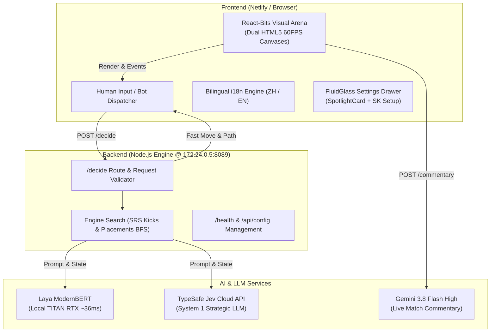

# ⚡ JEV vs LAYA · Tetris AI Battle Arena

<div align="center">

[](https://opensource.org/licenses/MIT)
[](https://app.netlify.com/sites/jev-laya-tetris/deploys)
[](https://jev-laya-tetris.netlify.app)
[](http://172.24.0.5:8089)
[](https://react-bits.dev)
[](./README_zh.md)

**A Next-Generation Competitive AI Tetris Duel Benchmark Platform**  
*Benchmarking Cloud System-1 Large Reasoning Models (TypeSafe Jev) against On-Premise GPU Real-Time ModernBERT (Laya) under strict TETR.IO Esports Standards.*

[**Live Demo (Netlify)**](https://jev-laya-tetris.netlify.app) · [**On-Premise Deployment**](http://172.24.0.5:8089) · [**中文文档 (README_zh)**](./README_zh.md)

</div>

---

## 🎬 Demo Video & Screenshots

### 🎥 Real-Time Match Gameplay Preview
<div align="center">
  
</div>

<p align="center">
  <em>⚡ Auto-playing dual battle animation: Jev (Cloud System 1) vs Laya (TITAN RTX GPU) with real-time APM/PPS telemetry and Gemini commentary.</em>
</p>

### 🎬 Full 1080p Commentary Video Player
<div align="center">
  <video src="https://jev-laya-tetris.netlify.app/docs/assets/demo_video.mp4" controls="controls" width="100%" style="max-width: 820px; border-radius: 8px; box-shadow: 0 4px 20px rgba(0,0,0,0.4);" poster="./docs/assets/screenshot_battle.png">
    <source src="https://jev-laya-tetris.netlify.app/docs/assets/demo_video.mp4" type="video/mp4">
    <source src="./docs/assets/demo_video.mp4" type="video/mp4">
    Your browser does not support the video tag.
  </video>
</div>

<p align="center">
  <a href="https://jev-laya-tetris.netlify.app/docs/assets/demo_video.mp4" target="_blank">🌐 <b>Stream 1080p Online (Netlify CDN)</b></a> &nbsp;•&nbsp; 
  <a href="./docs/assets/demo_video.mp4">📥 <b>Download demo_video.mp4 (2.6MB)</b></a>
</p>

---

### 📸 High-Resolution Screenshots

| ⚔️ VS Intro & Setup Screen | 🎮 Live In-Game Dual Match |
| :---: | :---: |
|  |  |
| *Unified Speed Control, Bilingual Switcher, CallChip Status Dock* | *Dual SRS Canvases, Real-Time APM/PPS HUD, Gemini Commentary Ticker* |

| ⚙️ React-Bits FluidGlass Settings Drawer | 🔑 Prominent Secret Key (SK) Configuration |
| :---: | :---: |
|  |  |
| *Segmented Service Tabs, SpotlightCard cursor lighting, Presets* | *Instant SK configuration at top of tab with eye-toggle mask* |

---

## 🌟 Key Highlights

1. **Dual AI Duel Architecture**:
   - **TypeSafe Jev (Cloud System 1)**: Excels at long-term board structure foresight, calculating Back-to-Back chains, downstacking survivability, and T-Spin Double opportunities.
   - **Convai Laya (Local GPU ModernBERT)**: Hosted on server `172.24.0.5` accelerated by NVIDIA TITAN RTX. Evaluates candidate placements with ultra-low **35-45ms latency**, unleashing high-frequency drops and impenetrable defensive pacing.
2. **Standardized TETR.IO Tournament Rules**:
   - True 7-Bag pseudo-random generation.
   - SRS (Super Rotation System) with full 5-point wall-kick tables.
   - Buffer zone height handling (20 visible + 20 buffer rows).
   - Dynamic garbage meter, cancel mechanics, combo tables, and T-spin recognition.
3. **Bilingual Localization (中英文无缝切换)**:
   - One-click instant language toggle (`🌐 EN / 中文`) in the top navigation bar.
   - Full translation coverage across HUD stats, AI commentary, game summaries, dialogs, and configuration panels.
4. **React-Bits Modern UI/UX**:
   - **`SpotlightCard`**: Interactive cursor-following lighting effects with frosted glass surface.
   - **`CallChip` Status Dock**: Live glowing heartbeat dots showing engine statuses and latency.
   - **`FluidGlass` Drawer**: Slide-out configuration drawer with spring easing (`cubic-bezier(0.16, 1, 0.3, 1)`) and zero-cutoff scrolling.
   - **Unified Speed Control**: Clean single dropdown from casual 0.8 PPS up to 36ms Superhuman MAX speed.
5. **Live Esports Commentary**:
   - Integrated Gemini 3.8 Flash High commentary desk generating real-time tactical commentary based on board danger, APM, and combos.

---

## 🏗️ Architecture Overview



---

## 🚀 Quick Start

### Prerequisites
- Node.js >= 18.0.0
- Python 3.9+ (Optional, for running local Laya model server or automated demo scripts)

### 1. Clone & Install
```bash
git clone https://github.com/HarryReidx/jev-laya-tetris.git
cd jev-laya-tetris
npm install
```

### 2. Configure Environment
Copy `.env.example` to `.env` or configure via the Settings Drawer:
```bash
PORT=8089

# Laya Local GPU Engine
LAYA_BASE_URL=http://127.0.0.1:8300
LAYA_MODEL=multilingual

# Jev Cloud API
JEV_API_BASE=https://api.typesafe.ai
JEV_API_KEY=your_typesafe_api_key_here

# Gemini AI Commentary (OpenAI-compatible)
GEMINI_PROXY_URL=https://generativelanguage.googleapis.com/v1beta/openai
GEMINI_API_KEY=your_gemini_api_key_here
GEMINI_MODEL=gemini-1.5-flash
```

### 3. Run Locally
```bash
node server.js
```
Open your browser at `http://localhost:8089`.

---

## ☁️ Deployment

### 1. Netlify Deployment
This project is configured with `netlify.toml` and `_redirects` for continuous deployment on Netlify.
- **Live URL**: [https://jev-laya-tetris.netlify.app](https://jev-laya-tetris.netlify.app)
- **Manual Build & Deploy**:
  ```bash
  python build_netlify.py
  npx netlify deploy --prod --dir netlify-dist
  ```

### 2. On-Premise Server (172.24.0.5)
The platform is fully containerized and deployable to Linux GPU hosts:
```bash
# Upload and restart on remote server
python deploy_remote.py
```
Check health status:
```bash
curl http://172.24.0.5:8089/health
```

---

## ⌨️ Control Keybindings

| Key | Action | Function |
| :--- | :--- | :--- |
| <kbd>←</kbd> <kbd>→</kbd> | Left / Right | Move falling piece horizontally |
| <kbd>↓</kbd> | Soft Drop | Increase gravity drop speed |
| <kbd>Space</kbd> | Hard Drop | Instantly drop and lock piece |
| <kbd>↑</kbd> / <kbd>X</kbd> | Rotate CW | 90° Clockwise SRS rotation |
| <kbd>Z</kbd> / <kbd>Ctrl</kbd> | Rotate CCW | 90° Counter-Clockwise SRS rotation |
| <kbd>A</kbd> | Rotate 180° | 180° Flip rotation |
| <kbd>C</kbd> / <kbd>Shift</kbd>| Hold | Hold current piece in queue |
| <kbd>Enter</kbd> | Start / Rematch | Start game or rapid rematch |
| <kbd>Esc</kbd> | Pause / Menu | Pause duel or close modal/drawer |

---

## 📄 License

This project is licensed under the [MIT License](LICENSE).
Feel free to use, modify, and distribute for personal, research, or commercial benchmarks.
