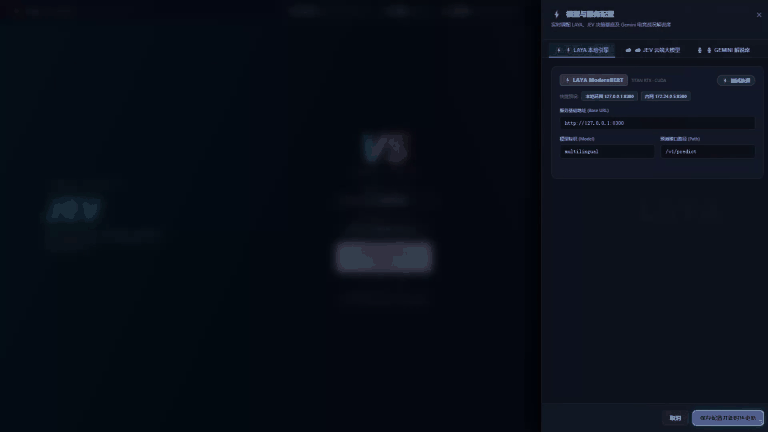
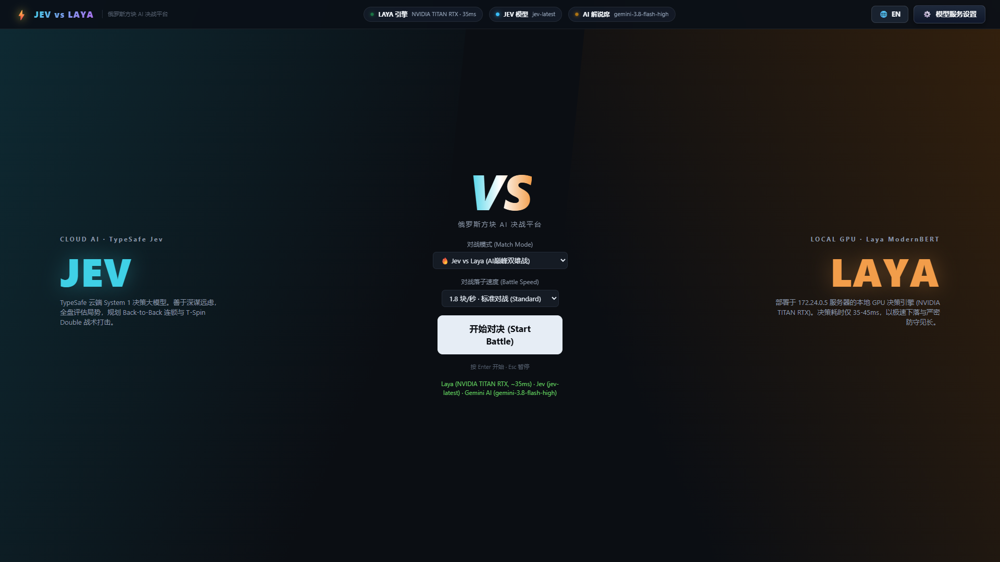
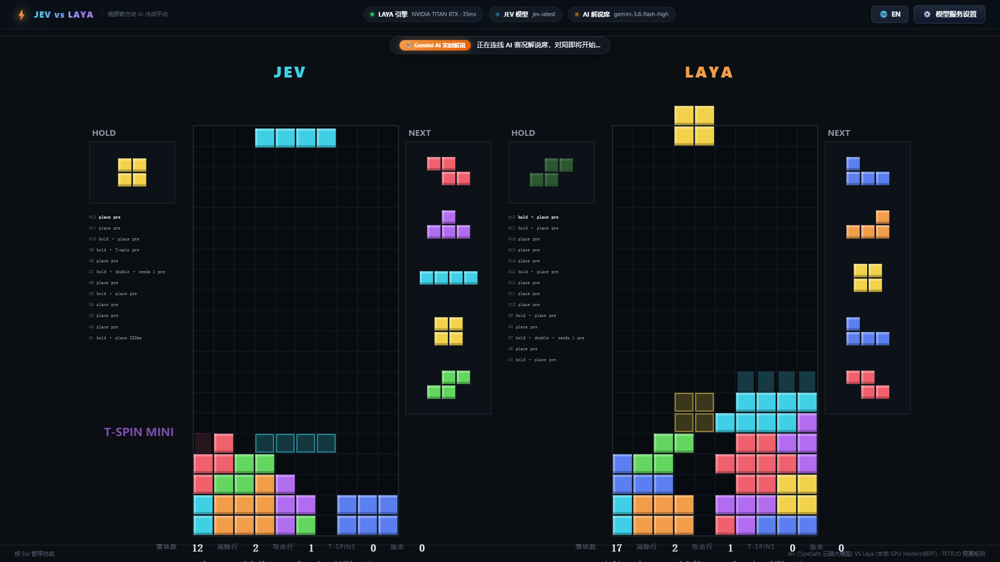
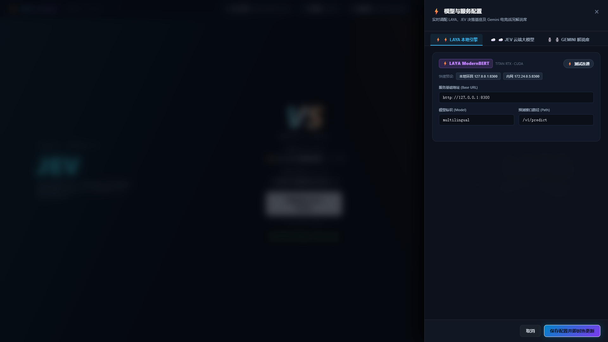
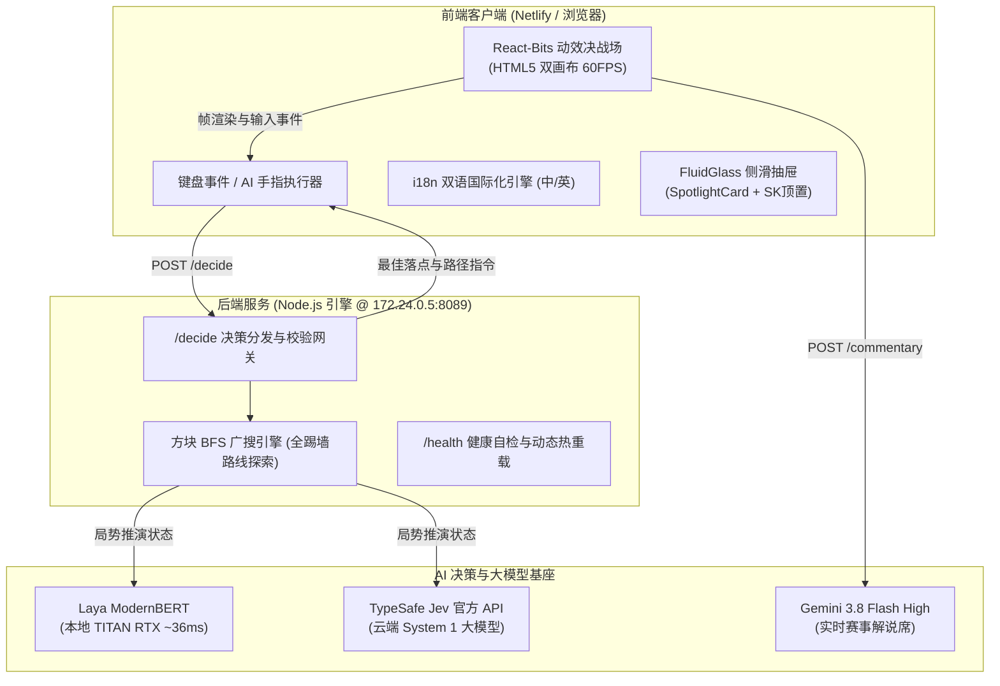

# ⚡ JEV vs LAYA · 俄罗斯方块 AI 巅峰决战平台

<div align="center">

[](https://opensource.org/licenses/MIT)
[](https://app.netlify.com/sites/jev-laya-tetris/deploys)
[](https://jev-laya-tetris.netlify.app)
[](http://172.24.0.5:8089)
[](https://react-bits.dev)
[](./README.md)

**次世代竞技级 AI 俄罗斯方块横向对标决战平台**  
*基于 TETR.IO 竞赛级标准，深度对比云端 System-1 战术大模型 (TypeSafe Jev) 与本地 GPU 实时决策模型 (Convai Laya ModernBERT) 的战略布局与反应极速。*

[**在线体验 (Netlify)**](https://jev-laya-tetris.netlify.app) · [**私有化集群环境**](http://172.24.0.5:8089) · [**English README**](./README.md)

</div>

---

## 🎬 演示视频与系统截图

### 🎥 实时双雄落子对战动态演示
<div align="center">
  
</div>

<p align="center">
  <em>⚡ 免点击自播动态演示：Jev (云端系统1) 与 Laya (TITAN RTX GPU) 极速落子对战，实时 APM/PPS 遥测与 Gemini 电竞解说。</em>
</p>

### 🎬 1080p 超清实机解说视频播放器
<div align="center">
  <video src="https://jev-laya-tetris.netlify.app/docs/assets/demo_video.mp4" controls="controls" width="100%" style="max-width: 820px; border-radius: 8px; box-shadow: 0 4px 20px rgba(0,0,0,0.4);" poster="./docs/assets/screenshot_battle.png">
    <source src="https://jev-laya-tetris.netlify.app/docs/assets/demo_video.mp4" type="video/mp4">
    <source src="./docs/assets/demo_video.mp4" type="video/mp4">
    您的浏览器暂不支持原生 video 播放标签。
  </video>
</div>

<p align="center">
  <a href="https://jev-laya-tetris.netlify.app/docs/assets/demo_video.mp4" target="_blank">🌐 <b>在线 1080p 超清流畅串流 (Netlify CDN)</b></a> &nbsp;•&nbsp; 
  <a href="./docs/assets/demo_video.mp4">📥 <b>下载 demo_video.mp4 视频文件 (2.6MB)</b></a>
</p>

---

### 📸 超清系统界面截图

| ⚔️ VS 对战准备与模式选择 | 🎮 实时双雄落子对决 |
| :---: | :---: |
|  |  |
| *统一落子速度选择、一键中英文切换、CallChip 态势胶囊* | *双画板 SRS 旋转渲染、实时 APM/PPS 指标、Gemini 电竞解说席* |

| ⚙️ React-Bits 毛玻璃流体抽屉 | 🔑 顶置醒目 Secret Key (SK) 配置 |
| :---: | :---: |
|  |  |
| *分段式模型切换 Tab、光斑随游标跟随 SpotlightCard、一键快捷预设* | *每个模型 Secret Key 顶置配置，支持明暗掩码切换与连通测速* |

---

## 🌟 核心特性

1. **AI 双雄巅峰对决机制**：
   - **TypeSafe Jev (云端 System 1)**：擅长大局观推演与盘面风险评估，精准规划 Back-to-Back 连锁与 T-Spin Double 战术打击。
   - **Convai Laya (本地 GPU ModernBERT)**：部署于 `172.24.0.5` 服务器，依托 NVIDIA TITAN RTX 硬件加速。决策延迟低至 **35-45ms**，以极速下落与紧凑防守见长。
2. **专业级 TETR.IO 竞赛规则标准**：
   - 标准 7-Bag 伪随机袋方块序列生成。
   - SRS (Super Rotation System) 完整 5 点踢墙检测算法。
   - 40 行棋盘管理（20 行可见区域 + 20 行缓冲溢出区域）。
   - 垃圾行缓冲队列、攻击反弹消除、连击增益倍率及 T-Spin 判定。
3. **极简无死角 UI/UX（参考 React-Bits）**：
   - **`SpotlightCard`**：卡片表面呈现逼真磨砂微光，光随游标平滑流动。
   - **`CallChip` 状态坞**：顶部指示灯呼吸脉动，显示真实微秒延迟。
   - **`FluidGlass` 侧滑抽屉**：右侧流体弹簧滑入，多重高斯模糊背景，彻底消除滚动条截断与死角。
   - **合并统一速度调节**：从休闲热身 0.8 PPS 到 GPU 极速 MAX 统一调控。
4. **一键中英文双语切换 (`i18n`)**：
   - 顶部快捷按钮 `🌐 EN / 中文` 瞬时切换。
   - 涵盖 HUD 统计指标、AI 战况解说、结算弹窗、快捷键指南及抽屉表单。
5. **电竞级 AI 赛况解说席**：
   - 基于 Gemini 3.8 Flash High 大模型，实时提取双方攻防、堆叠危险度与连击数据，生成电竞风实况解说。

---

## 🏗️ 架构与数据流图



---

## 🚀 快速启动指南

### 环境要求
- Node.js >= 18.0.0
- Python 3.9+（可选，用于本地 Laya 推理服务或自动化资产采集）

### 1. 克隆代码与依赖安装
```bash
git clone https://github.com/HarryReidx/jev-laya-tetris.git
cd jev-laya-tetris
npm install
```

### 2. 配置环境变量
在项目根目录创建或修改 `.env`（亦可直接在网页抽屉中可视化配置）：
```bash
PORT=8089

# Laya 本地决策服务
LAYA_BASE_URL=http://127.0.0.1:8300
LAYA_MODEL=multilingual

# Jev 云端决策模型
JEV_API_BASE=https://api.typesafe.ai
JEV_API_KEY=your_typesafe_api_key_here

# Gemini 电竞赛况解说席 (兼容 OpenAI 协议接口)
GEMINI_PROXY_URL=https://generativelanguage.googleapis.com/v1beta/openai
GEMINI_API_KEY=your_gemini_api_key_here
GEMINI_MODEL=gemini-1.5-flash
```

### 3. 本地启动
```bash
node server.js
```
启动后在浏览器打开 `http://localhost:8089`。

---

## ☁️ 多端部署模式

### 1. Netlify 全球 CDN 部署
已集成 `netlify.toml` 及 `_redirects`：
- **访问地址**：[https://jev-laya-tetris.netlify.app](https://jev-laya-tetris.netlify.app)
- **编译与部署命令**：
  ```bash
  python build_netlify.py
  npx netlify deploy --prod --dir netlify-dist
  ```

### 2. 生产服务器部署 (172.24.0.5)
```bash
# 执行自动化打包与热重启部署
python deploy_remote.py
```
查看健康检测：
```bash
curl http://172.24.0.5:8089/health
```

---

## ⌨️ 键位操作参考 (人类玩家模式)

| 按键 | 对应动作 | 说明 |
| :--- | :--- | :--- |
| <kbd>←</kbd> <kbd>→</kbd> | 左右横移 | 移动当前下落方块 |
| <kbd>↓</kbd> | 软降 (Soft Drop) | 加速方块下落 |
| <kbd>Space</kbd> | 硬降 (Hard Drop) | 瞬间下落至底部并直接锁定 |
| <kbd>↑</kbd> / <kbd>X</kbd> | 顺时针旋转 | 执行 90° 顺时针旋转 (带 SRS 踢墙) |
| <kbd>Z</kbd> / <kbd>Ctrl</kbd>| 逆时针旋转 | 执行 90° 逆时针旋转 |
| <kbd>A</kbd> | 180° 旋转 | 翻转 180° (SRS-180 规则) |
| <kbd>C</kbd> / <kbd>Shift</kbd>| 暂存 (Hold) | 暂存当前方块并置换储备方块 |
| <kbd>Enter</kbd> | 开始 / 重赛 | 快速开启对局或重开比赛 |
| <kbd>Esc</kbd> | 暂停 / 菜单 | 暂停对决或关闭配置抽屉 |

---

## 📄 开源许可证

本项目基于 [MIT 许可证](LICENSE) 开源，欢迎自由用于学术研究、性能对标测试或二次开发。
